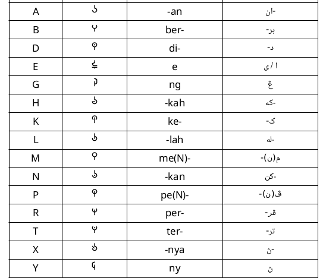
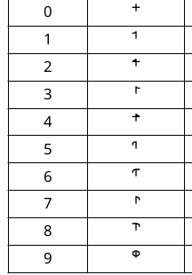
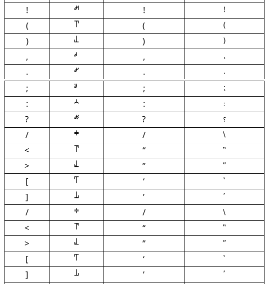

# MNH48 Beringin

This repository contains my attempt of making a font for [Beringin alphabet](https://omniglot.com/conscripts/beringin.htm) as I could not find any fonts for it online.

*Repositori ini mengandungi percubaan saya membuat fon tulisan untuk aksara Beringin kerana saya tidak jumpa sebarang fon untuknya dalam talian.*

## Usage / Kegunaan

To use, install the font and start typing. Note that Beringin is written vertically.

*Untuk guna, pasangkan fon dan mula menaip. Ambil perhatian bahawa Beringin ditulis secara menegak.*

All letters are lowercase, uppercase letters are used for special letters.

*Semua huruf ditulis pakai huruf kecil, huruf besar digunakan untuk huruf istimewa.*

## Special letter / Huruf Istimewa

## Numbers / Nombor

## Symbols / Simbol

## License / Lesen
OFL

