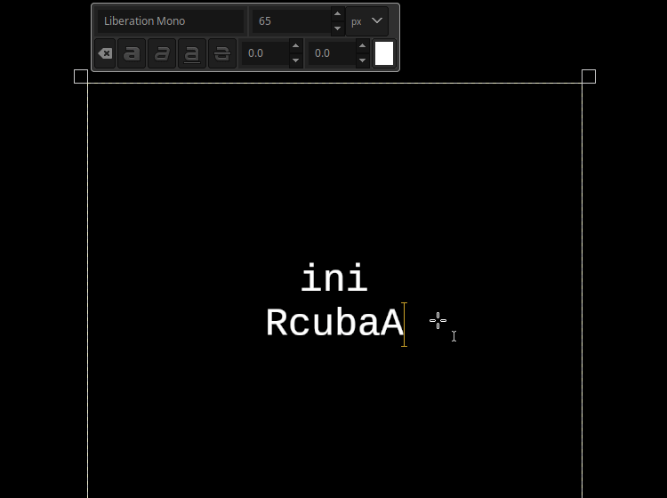
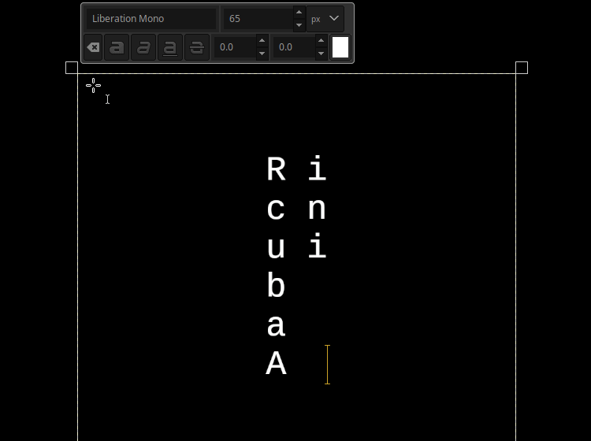
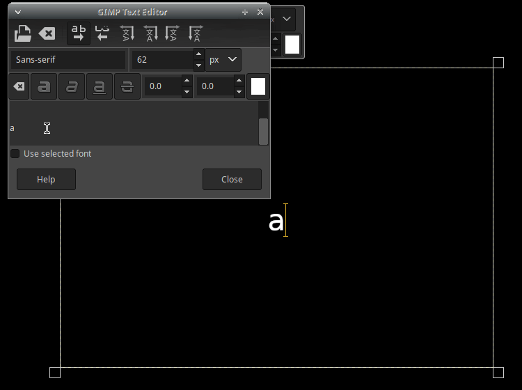

 ∷ **[Read in English]**  ∷ [Baca dalam bahasa Melayu Rumi](OLDREADME.md)  ∷ 
 ∷ [باچ دالم بهاس ملايو جاوي](OLDREADME.md)  ∷ [    ](OLDREADME.md)  ∷

# MNH48 Beringin

This repository contains my attempt of making a font for [Beringin alphabet](https://omniglot.com/conscripts/beringin.htm) as I could not find any fonts for it online.

## Table of Contents

- [Font Format](#font-format)
- [Font Version](#font-version)
  - [Normal Keyboard](#normal-keyboard)
    - [MNH48 Beringin Tegak](#mnh48-beringin-tegak)
    - [MNH48 Beringin Lintang](#mnh48-beringin-lintang)
  - [Special Keyboard](#special-keyboard)
    - [MNH48 Beringin PUA](#mnh48-beringin-pua)
- [Usage](#usage)
  - [Use the font on desktop device](#use-the-font-on-desktop-device)
    - [Installing the font on desktop](#installing-the-font-on-desktop)
      - [Windows](#windows)
      - [Linux](#linux)
      - [macOS](#macos)
      - [Other desktops](#other-desktops)
  - [Use the font on mobile device](#use-the-font-on-mobile-device)
    - [Installing the font on mobile](#installing-the-font-on-mobile)
      - [iOS](#ios)
      - [Android](#android)
      - [Other mobiles](#other-mobiles)
- [Letter Table](#letter-table)
- [License](#license)

## Font Format

There are four formats available for every versions:

- TrueType Font (TTF), the most widely used basic font format, installable on almost all devices currently in use worldwide, file ends with .ttf extension.
- OpenType Font (OTF), the newer font format, installable on newer devices and have more features than TTF, file ends with .otf extension.
- Scalable Vector Graphic (SVG), font format used by designers and certain websites, file ends with .svg extension.
- Web Open Font Format (WOFF), standard font format for websites, all sane website uses this format for font, file ends with .woff extension.

## Font Version

There are two ways to write Beringin, one is using normal keyboard and the other is using special keyboard. Overview and comparison between the two is available [here](https://beringin.mnh48.moe/en/keyboard.html). Regardless which keyboard you are using, you need to take note that Beringin is written vertically.

There are three versions available, two for normal keyboard and one for special keyboard.

You can also just download the zip file of all versions [here](https://github.com/beringin-mnh48/mnh48-beringin/releases/latest/download/mnh48beringin.zip).

### Normal keyboard

When using normal keyboard, you will type the Beringin letter using Latin letter and it will display the corresponsing Beringin letters assigned to the Latin letter. Detailed information of this implementation is available [here](https://beringin.mnh48.moe/en/normal-keyboard.html). Refer to [this table](https://beringin.mnh48.moe/en/latin-table.html) to see what Latin letter will display which Beringin letter.

There are two versions of font available for this purpose.

#### MNH48 Beringin Tegak

MNH48 Beringin Tegak is the font version intended for usage with **general** normal keyboard. The letters will appear to be rotated when written horizontally and it will appear upright when written vertically on supported software and/or hardware.

You can download the zip file [here](https://github.com/beringin-mnh48/mnh48-beringin/releases/latest/download/mnh48beringintegak.zip).

Preview:

Note: This GIF had the best framerate I could record on my 32-bit netbook, consider [donating](https://meta.mnh48.moe/en/support) so I can build a decent computer for better maintenance of this repository.

#### MNH48 Beringin Lintang

MNH48 Beringin Lintang is the font version intended for usage with **legacy** normal keyboard. The letters will always appear upright regardless it is written horizontally or vertically. This version is useful for older softwares that does not have support for vertical text, just write horizontally and manually insert line break after each character.

You can download the zip file [here](https://github.com/beringin-mnh48/mnh48-beringin/releases/latest/download/mnh48beringinlintang.zip).

Preview:

Note: This GIF had the best framerate I could record on my 32-bit netbook, consider [donating](https://meta.mnh48.moe/en/support) so I can build a decent computer for better maintenance of this repository.

### Special keyboard

When using special keyboard, you will type the Beringin letter using characters assigned in the Unicode Private Use Area (PUA). This make it possible to also write Latin alongside Beringin with the same font. The font itself does not have any letters for Latin so your system will take other font to display Latin. Detailed information of this implementation is available [here](https://beringin.mnh48.moe/en/special-keyboard.html). Refer to [this table](https://beringin.mnh48.moe/en/unicode-table.html) for all characters.

There is only one version of font available for this purpose.

#### MNH48 Beringin PUA

MNH48 Beringin PUA is the font version intended for usage with special keyboard. The letters given out by the keyboard are standalone, you don't need to mess with Latin or refer to any table to use it.

You can download the zip file [here](https://github.com/beringin-mnh48/mnh48-beringin/releases/latest/download/mnh48beringinpua.zip).

There are different ways of writing on special keyboard so that depends on your system, refer to [this page](https://beringin.mnh48.moe/en/keyboard) for more information.

Preview (uses [Beringin fcitx](https://github.com/beringin-mnh48/fcitx-table-beringin/) IME keyboard layout):

Note: This GIF had the best framerate I could record on my 32-bit netbook, consider [donating](https://meta.mnh48.moe/en/support) so I can build a decent computer for better maintenance of this repository.

## Usage

Usage of the font depends on which format and what device you are using.

### Use the font on desktop device

Desktop device here refers to any devices running desktop version of operating systems such as Linux, Windows, macOS and others, regardless the actual device.

To use the font:
1. Grab the zip file of the appropriate version as needed from download link(s) provided (or grab all of them if you're not sure)
2. Unzip the file downloaded using zip tools such as 7zip, WinRAR, or others
3. Install the font (see below)
4. Now you can use the font

#### Installing the font on desktop

##### Windows

1. Double-click the TTF or OTF file
  - Try OTF file first, if that fails then try TTF file
2. Font viewer will start and show the font content
3. Click on "Install" at top right side of the font viewer

##### Linux

1. Copy the OTF font file to your user font directory
  - Usually the user font directory is at `~/.local/share/fonts/` but it varies from one distro to the others
  - If your distro is too old, copy the TTF font file instead
2. Run `fc-cache -fv` from your terminal emulator

##### macOS

1. Double-click the OTF file in the Finder
2. Font preview window will now open with that font
3. Click on "Install Font" at bottom right corner
4. Wait for your Mac to validate the font for issue
5. If it opens Font Book then it is installed
  - If not then you're out of luck

##### Other desktops

For other operating system, please figure out where the font directory is located and copy the TTF file to the directory, then restart. If that doesn't work then you're out of luck.

### Use the font on mobile device

Mobile device here refers to any devices running mobile version of operating systems such as Android, iOS, etc, regardless the actual device.

To use the font:
1. Grab the zip file of the appropriate version as needed from download link(s) provided (or grab all of them if you're not sure)
2. Unzip the file downloaded using zip tools such as ZArchiver, RAR or others
3. Install the font (see below)
4. Now you can use the font

#### Installing the font on mobile

##### iOS

1. Install font manager app from the App Store, such as iFont, AnyFont, Fonteer, etc
2. Tap on the OTF font file that you have unzip earlier
3. Your font manager will now launch
  - If it does not launch, hold the file and select "Copy to [font manager]", now it will launch
4. Tap on "Import Font" so that the your font manager will import it for processing
5. Tap on "Install Font" so that it will be installed

##### Android

There are so many different ways to install font on Android. If you're going to use the font only for specific app then you can just copy the TTF font file to that app's folder. For example, if you want to use it in Phonto app, put the file in `Internal Storage > Phonto > fonts`. The exact folder varies from app to app.

To install it systemwide, install font manager app from the Play Store, such as iFont, zFont, etc, that app will take care on the different types of installation needed which is different from one Android device to the other.

##### Other mobiles

You need to look for font manager specific for your device, and then read the instructions from there on how to install the font.

## Letter table

- For normal keyboard, refer to [this table](https://beringin.mnh48.moe/en/latin-table.html).
- For special keyboard, refer to [this table](https://beringin.mnh48.moe/en/unicode-table.html).

## License

All the fonts are licensed under OFL, the media files under CC-BY 4.0, and the rest under MIT.
