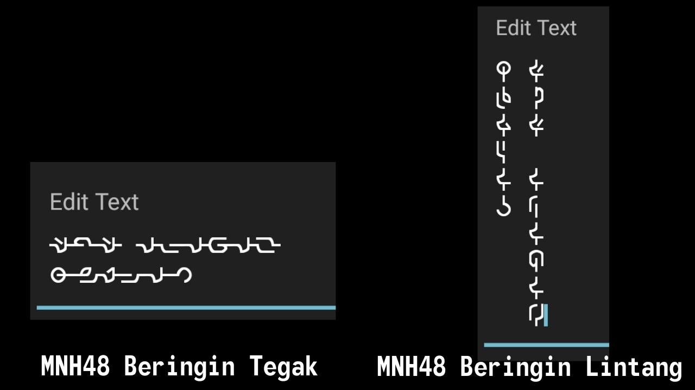
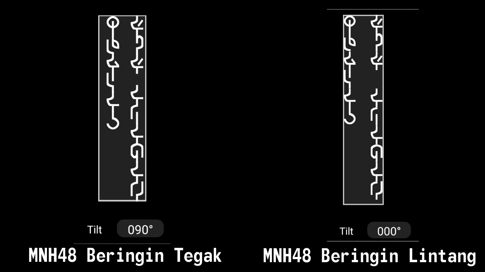

This is the attempt of making a font for the [Beringin alphabet](https://omniglot.com/conscripts/beringin.htm) as I could not find any fonts for it online.

## Usage

To use, install the appropriate version of the font and start typing. Note that Beringin is written vertically. All letters are lowercase, uppercase letters are used to display special letters.

- MNH48BeringinTegak (MNH48 Beringin Tegak) is what you should use for office files or any software that has vertical text support or rotate tools, it has all the glyphs designed horizontal way so that it will appear correctly in vertical.
- MNH48BeringinLintang (MNH48 Beringin Lintang) is what you should use for older software that does not have any vertical text support or rotate tools, it has all the glyphs designed vertical way, so you need to manually insert line break after each character, otherwise it will appear wrongly.

## Table of letters

### Vowels

| Actual letter | What you type | IPA | Letter in Rumi | Letter in Jawi |
| ------------- | ------------- | --- | -------------- | -------------- |
| a | a | a | a | ا |
| e | e | e | e | ي |
| i | i | i | i | ي |
| o | o | o | o | و |
| u | u | u | u | و |
| E | E | ə | e | ى |

### Consonants

| Actual letter | What you type | IPA | Letter in Rumi | Letter in Jawi |
| ------------- | ------------- | --- | -------------- | -------------- |
| b | b | b | b | ب |
| p | p | p | p | ڤ |
| d | d | d | d | د |
| t | t | t | t | ت |
| c | c | t∫ | c | چ |
| j | j | dʒ | j | ج |
| g | g | g | g | ݢ |
| k | k | k | k | ک |
| m | m | m | m | م |
| n | n | n | n | ن |
| Y | Y | ɲ | ny | ڽ |
| G | G | ŋ | ng | ڠ |
| s | s | s | s | س |
| z | z | z | z | ز |
| l | l | l | l | ل |
| r | r | r | r | ر |
| h | h | h | h | ه |
| f | f | f | f | ف |
| y | y | j | y | ي |
| w | w | w | w | و |
| v | v | v | v | ۏ |
| q | q | k | q | ق |
| x | x | s/z/ks | x | س\ز\کس |

### Affixes

These are used to mark the affixes that exist in the Malay language. It is also possible to be typed out without using these markers but it will take more spaces as Malay uses affixes heavily.

Sample word: mempertanggungjawabkannya (meaning: to make someone to have the responsibility on something that the speaker is talking about) which has two prefixes, meN- and per-; and two suffixex, -kan and -nya. Instead of typing out each letters for the affixes, you can just type in one letter for each of them.

In this sample, it would end up as MRtaGguGjawabNX (15 letters) instead of mEmpErtaGguGjawabkanYa (22 letters) for the same word. It is written horizontally here just for the sake of comparison, it must be written vertically when using it the proper way.

| Actual letter | What you type | Affixes |
| ------------- | ------------- | ------- |
| M | M | meN- |
| D | D | di- |
| P | P | peN- |
| S | S | se- |
| B | B | ber- |
| T | T | ter- |
| R | R | per- |
| K | K | ke- |
| A | A | -an|
| N | N | -kan |
| H | H | -kah |
| L | L | -lah |
| X | X | -nya |

### Numbers

Just type in the numbers the normal way.

| Numbers: | Zero | One | Two | Three | Four | Five | Six | Seven | Eight | Nine |
| --- | --- | --- | --- | --- | --- | --- | --- | --- | --- | --- |
| Numbers you type: | 0 | 1 | 2 | 3 | 4 | 5 | 6 | 7 | 8 | 9 |
| Numbers you get: | 0 | 1 | 2 | 3 | 4 | 5 | 6 | 7 | 8 | 9 |

### Symbols

| Actual letter | What you type | Symbols | Names |
| ------------- | ------------- | ------- | ----- |
| . | . | . | Period |
| , | , | , | Comma |
| ? | ? | ? | Question |
| ! | ! | ! | Exclamation |
| : | : | : | Colon |
| ; | ; | ; | Semicolon |
| / | / | / | Slanted bar |
| ( | ( | ( | Opening bracket |
| ) | ) | ) | Closing bracket |
| [ | [ | ‘ | Opening single quote |
| ] | ] | ’ | Closing single quote |
| &lt; | < | “ | Opening double quote |
| &gt; | > | ” | Closing double quote |

## License
OFL

