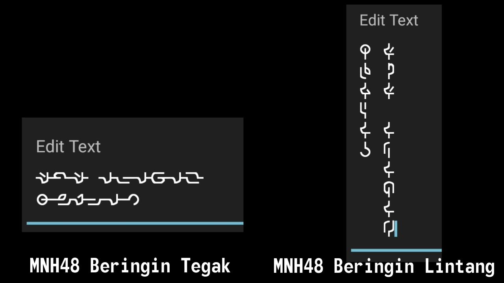
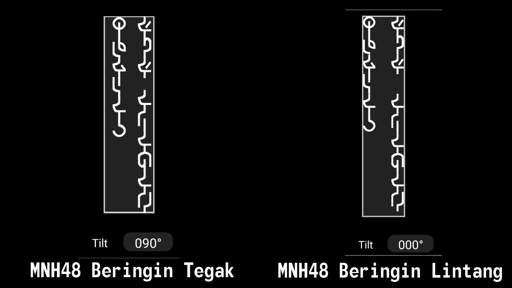

Ini percubaan membuat fon tulisan untuk [Aksara Beringin](https://omniglot.com/conscripts/beringin.htm) kerana saya tidak jumpa sebarang fon untuknya dalam talian.

## Kegunaan

Untuk guna, pasangkan fon dengan versi yang diperlukan dan mula menaip. Ambil perhatian bahawa tulisan Beringin ditulis secara menegak. Semua huruf pakai huruf kecil, huruf besar digunakan untuk paparkan huruf istimewa.

- MNH48BeringinTegak (MNH48 Beringin Tegak) ialah versi yang anda patut guna untuk fail pejabat atau sebarang perisian yang mempunyai sokongan tulisan menegak atau alat pemutar, ia mempunyai glif yang direka secara melintang supaya ia dipaparkan dengan betul ketika menegak.
- MNH48BeringinLintang (MNH48 Beringin Lintang) ialah versi yang anda patut guna untuk perisian lama yang tiada sokongan tulisan menegak atau alat pemutar, ia mempunyai glif yang direka secara menegak, jadi anda perlu masukkan pemutus barisan secara manual selepas setiap aksara, jika tidak ia akan dipaparkan secara salah.

## Jadual huruf

### Vokal

| Huruf sebenar | Apa perlu ditaip | Bunyi | Huruf Rumi | Huruf Jawi |
| ------------- | ---------------- | ----- | ---------- | ---------- |
| a | a | a | a | ا |
| e | e | e | e | ي |
| i | i | i | i | ي |
| o | o | o | o | و |
| u | u | u | u | و |
| E | E | ə | e | ى |

### Konsonan

| Huruf sebenar | Apa perlu ditaip | Bunyi | Huruf Rumi | Huruf Jawi |
| ------------- | ---------------- | ----- | ---------- | ---------- |
| b | b | b | b | ب |
| p | p | p | p | ڤ |
| d | d | d | d | د |
| t | t | t | t | ت |
| c | c | t∫ | c | چ |
| j | j | dʒ | j | ج |
| g | g | g | g | ݢ |
| k | k | k | k | ک |
| m | m | m | m | م |
| n | n | n | n | ن |
| Y | Y | ɲ | ny | ڽ |
| G | G | ŋ | ng | ڠ |
| s | s | s | s | س |
| z | z | z | z | ز |
| l | l | l | l | ل |
| r | r | r | r | ر |
| h | h | h | h | ه |
| f | f | f | f | ف |
| y | y | j | y | ي |
| w | w | w | w | و |
| v | v | v | v | ۏ |
| q | q | k | q | ق |
| x | x | s/z/ks | x | س\ز\کس |

### Imbuhan

Huruf di sini digunakan untuk menanda imbuhan yang wujud dalam bahasa Melayu. Ia juga boleh ditulis tanpa menggunakan penanda tetapi ia akan mengambil agak banyak ruang kerana bahasa Melayu ini penuh dengan imbuhan.

Perkataan contoh: mempertanggungjawabkannya yang mempunyai empat imbuhan iaitu meN-, per-, -kan dan -nya. Daripada menaip kesemua imbuhan dengan setiap huruf, boleh saja gantikan terus dengan penanda imbuhan.

Dalam contoh ini, ia boleh dieja sebagai MRtaGguGjawabNX (15 huruf) menggantikan mEmpErtaGguGjawabkanYa (22 huruf) untuk perkataan yang sama. Ia ditulis secara melintang di sini hanya untuk tujuan perbandingan, ia mesti ditulis secara menegak apabila hendak digunakan.

| Huruf sebenar | Apa perlu ditaip | Imbuhan |
| ------------- | ---------------- | ------- |
| M | M | meN- |
| D | D | di- |
| P | P | peN- |
| S | S | se- |
| B | B | ber- |
| T | T | ter- |
| R | R | per- |
| K | K | ke- |
| A | A | -an|
| N | N | -kan |
| H | H | -kah |
| L | L | -lah |
| X | X | -nya |

### Nombor

Taip saja nombor macam biasa.

| Nombor: | Kosong | Satu | Dua | Tiga | Empat | Lima | Enam | Tujuh | Lapan | Sembilan |
| --- | --- | --- | --- | --- | --- | --- | --- | --- | --- | --- |
| Apa perlu ditaip: | 0 | 1 | 2 | 3 | 4 | 5 | 6 | 7 | 8 | 9 |
| Apa yang dipaparkan: | 0 | 1 | 2 | 3 | 4 | 5 | 6 | 7 | 8 | 9 |

### Simbol

| Huruf sebenar | Apa perlu ditaip | Simbol | Nama |
| ------------- | ---------------- | ------ | ---- |
| . | . | . | Noktah |
| , | , | , | Koma |
| ? | ? | ? | Soal |
| ! | ! | ! | Seru |
| : | : | : | Titik bertitik |
| ; | ; | ; | Koma bertitik |
| / | / | / | Palang miring |
| ( | ( | ( | Kurungan pembuka |
| ) | ) | ) | Kurungan penutup|
| [ | [ | ‘ | Petik tunggal pembuka |
| ] | ] | ’ | Petik tunggal penutup |
| &lt; | < | “ | Petik ganda pembuka |
| &gt; | > | ” | Petik ganda penutup |

## Lesen
OFL

